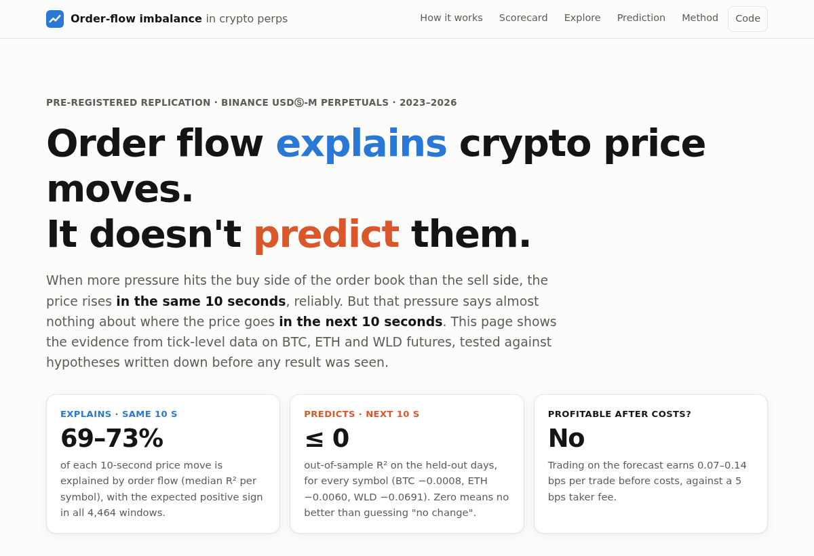
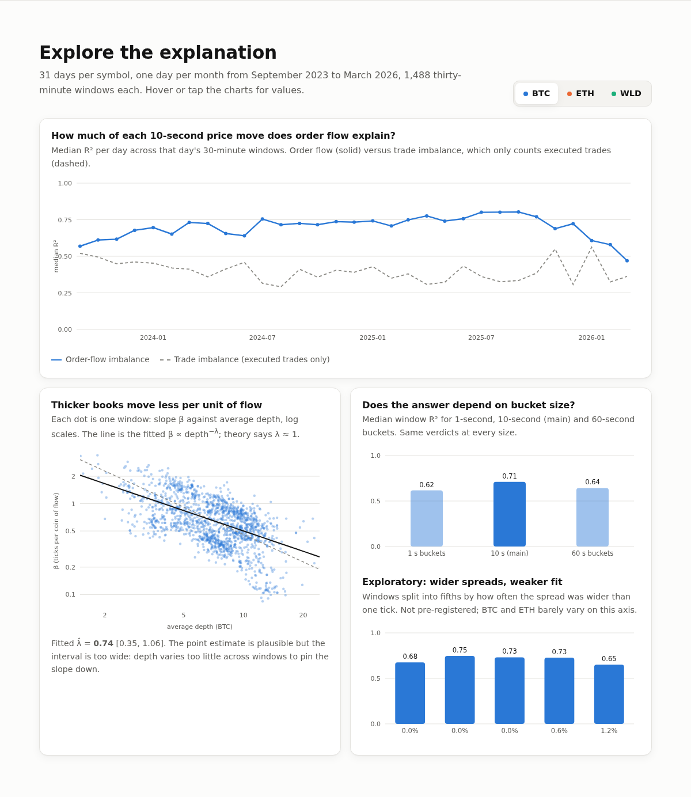
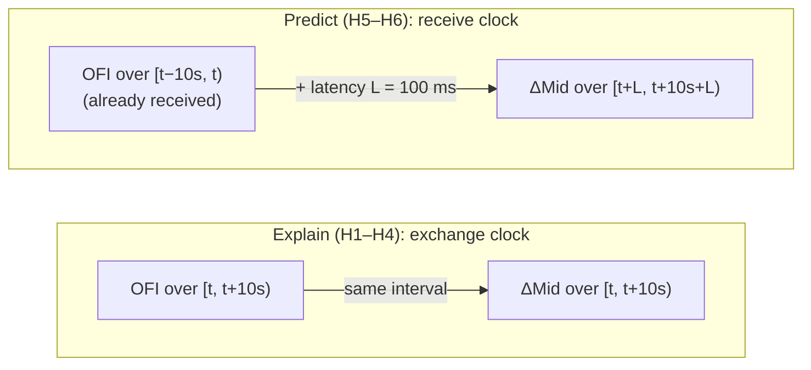
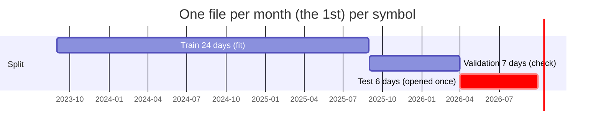
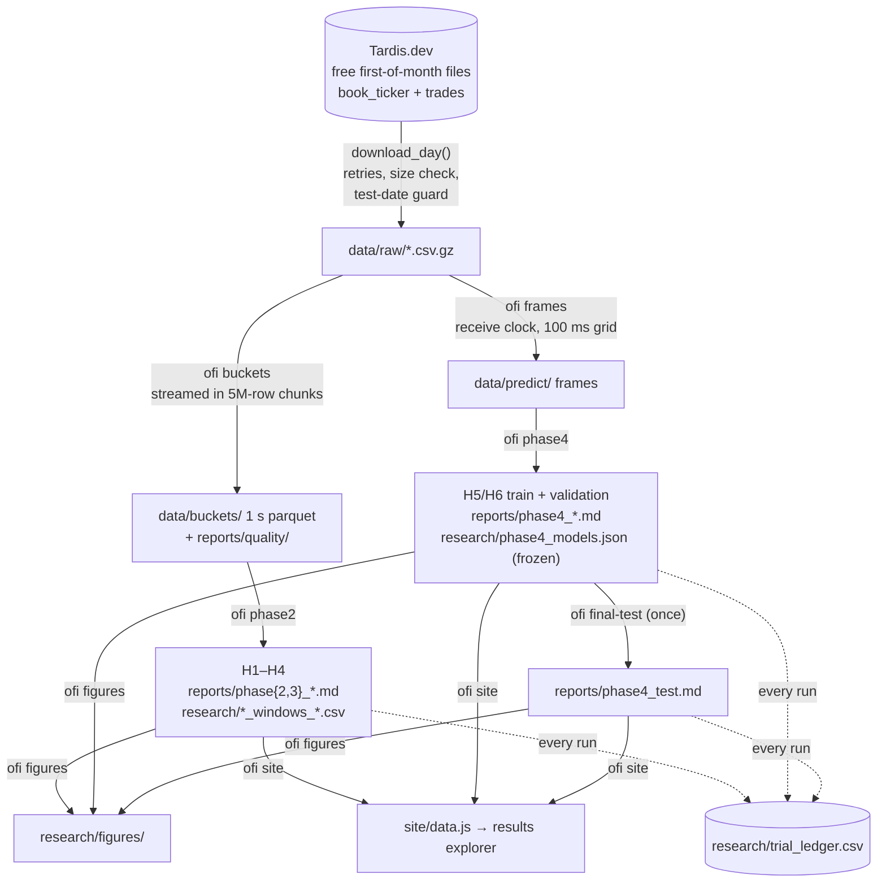

# Order-flow imbalance in crypto perps: explains, doesn't predict

[](https://github.com/sakshamg251206/ofi-crypto-perps/actions/workflows/ci.yml)


A pre-registered replication of Cont, Kukanov & Stoikov (2014) on Binance USDⓈ-M perpetual futures (BTCUSDT, ETHUSDT, WLDUSDT; 31 days each, 2023-09 → 2026-03, native top-of-book data), plus an out-of-sample test of whether the same signal can predict prices after trading costs.

**The answer in one sentence:** order-flow imbalance over 10-second buckets explains a median **69–73%** of same-interval price moves, but on six held-out days its out-of-sample R² for the **next** 10 seconds is **≤ 0** on every symbol, and trading on it would earn 0.07–0.14 bps per trade against a 5 bps fee.



**→ Full write-up: [research/memo.md](research/memo.md)** · **→ Results explorer: [`site/`](site/index.html)** (open `site/index.html` in a browser, or `make serve`)

---

## Contents

- [What this is, in plain language](#what-this-is-in-plain-language)
- [Results](#results)
- [How it works](#how-it-works)
- [Architecture](#architecture)
- [Getting started](#getting-started)
- [Running the pipeline](#running-the-pipeline)
- [Testing](#testing)
- [Deploying the results explorer](#deploying-the-results-explorer)
- [Project structure](#project-structure)
- [Key technical decisions](#key-technical-decisions)
- [Limitations and future work](#limitations-and-future-work)

## What this is, in plain language

On an exchange, buyers and sellers leave orders in an **order book**. The best (highest) buy price is the *bid* and the best (lowest) sell price is the *ask*. Every second, thousands of orders are added, cancelled or filled at those two prices.

**Order-flow imbalance (OFI)** adds those events up into one number: positive when buying pressure dominates, negative when selling pressure does. A well-known 2014 paper showed that, for US stocks, OFI explains most of the short-term movement in prices.

This project asks two questions about crypto futures:

1. **Does OFI explain price moves?** If buying pressure was high in the last 10 seconds, did the price rise in those *same* 10 seconds? (**Yes**, strongly.)
2. **Does OFI predict price moves?** Using only data a trader would really have had, does it forecast the *next* 10 seconds well enough to profit after fees? (**No.**)

**Why it matters:** "explains" and "predicts" are easy to confuse. A signal can line up almost perfectly with price changes and still be useless for trading, because it describes the move while it happens instead of ahead of time. This study measures that gap carefully, with hypotheses and pass criteria committed *before* any result was seen, so the answer can't be tuned after the fact.

## Results

| | BTCUSDT | ETHUSDT | WLDUSDT |
|---|---|---|---|
| H1 OFI explains same-interval ΔMid (β > 0 in all windows; median R²) | ✓ 0.71 | ✓ 0.69 | ✓ 0.73 |
| H2 linear (ΔR² from curvature < 0.02) | ✓ | ✓ | ✗ 0.045 |
| H3 β ∝ 1/depth^λ, λ̂ ∈ [0.7, 1.3] with a tight CI | ✗ CI too wide | ✓ 1.13 | ✓ 1.08 |
| H4 OFI beats trade imbalance | ✓ +0.32 | ✓ +0.34 | ✓ +0.39 |
| **H5** predicts next interval out of sample (test days) | **✗** −0.0008 | **✗** −0.006 | **✗** −0.069 |
| **H6** survives costs (break-even per side vs 5 bps fee) | ✗ 0.11 bps | ✗ 0.07 bps | ✗ 0.14 bps |


- **Explanation replicates everywhere.** The slope is positive in all 4,464 thirty-minute windows, and OFI roughly doubles the explanatory power of executed trades alone: cancellations and new limit orders carry most of the information.
- **Prediction fails everywhere.** No variant (depth-normalised OFI, lagged returns, lagged trade imbalance, 0/100/500 ms latency) beats a "no change" forecast on the held-out days.
- **The two failures in H1–H4 are reported as failures:** BTC's depth varies too little to pin down λ (H3), and WLD shows real curvature (H2).

Detailed numbers, confidence intervals and figures: [research/memo.md](research/memo.md) and the generated reports in [`reports/`](reports/).

### The results explorer

`site/` is a static page that renders every number above from the committed results, so a reader can explore per-day R², β against depth, robustness checks, and the prediction and cost results per symbol without installing anything.



## How it works

For every change to the best bid or ask, the order-flow contribution is

```
e_n = 1{Pb_n ≥ Pb_{n−1}}·qb_n − 1{Pb_n ≤ Pb_{n−1}}·qb_{n−1} − 1{Pa_n ≤ Pa_{n−1}}·qa_n + 1{Pa_n ≥ Pa_{n−1}}·qa_{n−1}
```

and OFI over a bucket is the sum of e_n in it. Each 30-minute window is fitted as ΔMid = α + β·OFI + ε with Newey–West errors; aggregate claims use a day-block bootstrap (10,000 draws).

The crucial difference between the two halves of the study is **timing**:



For prediction, data is timed by when it *arrived* at the receiver, and the forecast window starts only after a latency buffer. A property test checks that the target interval never overlaps the input interval, for every latency.

The sample was split before any prediction code existed, and the test days were opened exactly once:



H1–H4 use all 31 in-sample days. The data loader raises `HeldOutDateError` for any test date unless called from the one-shot `ofi final-test`, which refuses to run again now that its report exists.

## Architecture



- **`ofi` library** (`src/ofi/`): pure, tested functions for OFI and bucketing, regressions, inference and prediction, plus I/O with the test-date guard.
- **Pipeline** (`src/ofi/pipeline/`): one module per CLI command. Each step reads the previous step's output from disk, so steps can be re-run independently.
- **Outputs**: everything a reader needs (reports, per-window results, frozen models, figures, ledger) is committed. Raw vendor data and intermediate parquet files are not.

### Tech stack

| Layer | Choice | Why |
|---|---|---|
| Language | Python 3.12+ | Standard for quantitative research; the pinned stack supports 3.12–3.14. |
| Data | pandas, NumPy, PyArrow (parquet) | Vectorised bucketing of up to 61M rows per day, streamed in chunks to stay within 8 GB of RAM. |
| Statistics | statsmodels (OLS + Newey–West), SciPy (NLS, Spearman) | Well-tested implementations; the bootstrap is a short hand-written loop so the resampling unit (days) is explicit. |
| Figures | Matplotlib | Static, reproducible memo figures. |
| Results explorer | Plain HTML, CSS and JavaScript (SVG charts) | No framework or build step for a single read-only page; it works from `file://` and on any static host. |
| Quality | pytest, ruff, GitHub Actions | 99 offline tests, linting, CI on Python 3.12–3.14. |

## Getting started

**Requirements:** Python 3.12 or newer. Running the tests and the results explorer needs nothing else. Re-running the analysis needs about 8 GB of RAM and disk space for downloads (about 6 GB for one symbol, 17 GB for the full study).

```bash
git clone https://github.com/sakshamg251206/ofi-crypto-perps.git
cd ofi-crypto-perps
make install          # creates .venv, installs the package with dev + figures extras
make check            # lint + 99 tests, offline, about 30 s
make serve            # results explorer on http://localhost:8000
```

Without `make`: `python3 -m venv .venv && .venv/bin/pip install -e ".[dev,figures]"`, then use `.venv/bin/ofi` and `.venv/bin/pytest`.

### Environment variables

No API keys or credentials are needed: the data files are free. Both variables are optional; copy [`.env.example`](.env.example) to `.env` to set them (the Makefile loads it automatically).

| Variable | Default | Purpose |
|---|---|---|
| `OFI_DATA_DIR` | `./data` | Where raw downloads and intermediate parquet files go. Point it at a large disk. |
| `OFI_PROJECT_DIR` | the repository root | Where `reports/` and `research/` are read and written. |

## Running the pipeline

Everything runs through one command. Start with `ofi status`, which shows what is on disk and suggests the next step.

```bash
ofi --help                                        # all commands, in pipeline order
ofi status                                        # configuration and progress
ofi buckets --symbol BTCUSDT --dates 2025-09-01   # try one day first
```

Reproducing `reports/phase2_BTCUSDT.md` (downloads 31 BTC days):

```bash
ofi buckets --symbol BTCUSDT
ofi phase2  --symbol BTCUSDT
```

Full pipeline, in order:

| Step | Command | Output |
|---|---|---|
| 1. Buckets per symbol (exchange clock) | `ofi buckets --symbol S` | `data/buckets/…`, `reports/quality/…` |
| 2. H1–H4 | `ofi phase2 --symbol S --phase {2,3}` | `reports/phase{2,3}_S.md`, `research/phase{2,3}_windows_S_*.csv` |
| 3. Third-symbol selection (2023-08-01 only) | `ofi select-symbol` | `reports/third_symbol_selection.md` |
| 4. Receive-clock frames | `ofi frames` | `data/predict/…` |
| 5. H5/H6 train / validation / walk-forward | `ofi phase4` | `reports/phase4_S.md`, `research/phase4_models.json` |
| 6. One-shot test (already used; refuses to re-run) | `ofi final-test --final` | `reports/phase4_test.md` |
| 7. Figures | `ofi figures` | `research/figures/` |
| 8. Results explorer data | `ofi site` | `site/data.js` |

`ofi phase1` re-runs the original 3-day pilot (`reports/phase1_h1.md`). It loads whole days in memory and needs about 10 GB of RAM.

**Note:** every analysis step appends rows to `research/trial_ledger.csv` and overwrites its report. That is intended (it keeps the record of how much was tried), so commit or discard those changes deliberately.

## Testing

```bash
make check        # or: ruff check . && pytest
```

The suite runs offline in about 30 seconds and focuses on the parts most likely to be silently wrong:

- hand-computed e_n cases and bucket-boundary conventions;
- a **no-look-ahead property test** for the prediction target at every latency;
- chunked processing equals single-pass processing, and 1 s buckets aggregated to 10 s equal direct 10 s buckets;
- the test-date guard, truncated and failed downloads (network mocked);
- an **end-to-end test** that runs the real `ofi` CLI (buckets → H1–H4 → prediction frames) on synthetic Tardis-format files in a temporary project;
- the results-explorer export reproduces the committed reports' headline numbers, and the committed `site/data.js` is current.

CI ([`.github/workflows/ci.yml`](.github/workflows/ci.yml)) runs lint and tests on Python 3.12, 3.13 and 3.14 for every push and pull request.

## Deploying the results explorer

The analysis is a batch pipeline run on a workstation; there is no server to deploy. The results explorer is a static folder:

- **GitHub Pages:** enable Pages once (*Settings → Pages → Source: GitHub Actions*), then run the **Deploy results explorer** workflow from the Actions tab. It regenerates `data.js` from the committed results and publishes `site/`.
- **Anywhere else:** run `ofi site` and upload the four files in `site/` to any static host.

## Project structure

```
├── src/ofi/              library
│   ├── ofi.py            e_n, OFI, bucketing (streaming), trade imbalance, funding exclusion
│   ├── regress.py        per-window OLS with Newey–West errors
│   ├── stats.py          day-block bootstrap, H3 depth-scaling NLS
│   ├── predict.py        receive-clock frames, out-of-sample R², sign strategy net of costs
│   ├── io.py             downloads and the held-out test-date guard
│   ├── quality.py        per-day data-quality checks, tick inference
│   ├── ledger.py         append-only trial ledger
│   ├── config.py         paths, symbols, sample split
│   ├── cli.py            the `ofi` command
│   └── pipeline/         one module per command (buckets, phase2, frames, phase4, …)
├── tests/                pytest suite (unit + end-to-end)
├── reports/              generated results and per-day data-quality reports
├── research/             memo, figures, per-window results, frozen models, trial ledger
├── site/                 static results explorer (data.js is generated)
├── docs/                 pre-registration, decision log, progress log, README images
└── .github/workflows/    CI and Pages deployment
```

## Key technical decisions

Each is argued in full, with a date, in [docs/DECISIONS.md](docs/DECISIONS.md).

- **Pre-registration.** [docs/HYPOTHESES.md](docs/HYPOTHESES.md) fixed the hypotheses, pass criteria, sample and split before the first result and has not been edited since. Every interpretation and bug that touched the analysis is logged *before* the run it governs.
- **Native `book_ticker` over Tardis `quotes`.** `quotes` is rebuilt from a ~25 ms batched depth feed and folds ~19 book events into each row; CKS define e_n per event.
- **Two clocks.** Exchange time for the mechanical, same-interval relation; receive time plus latency for anything claimed to be tradable, which prevents look-ahead from clock skew.
- **Per-symbol estimation.** Tick sizes and quantity units differ, so pooling symbols in one regression would mix units.
- **NLS instead of log-log for H3.** log β is undefined for β ≤ 0; dropping those windows would select on the outcome.
- **Day-block bootstrap.** Days are a month apart and roughly independent; windows within a day are not.
- **Break-even cost instead of a pass/fail threshold for H6,** so readers can compare against their own fee tier.
- **A mechanical third-symbol rule applied to a pre-sample date** (2023-08-01), so the choice of WLDUSDT involved no peeking.
- **Exact dependency pins,** so the bootstrap and NLS reproduce bit for bit.
- **Bounded memory.** Days with up to 61M rows are streamed in 5M-row chunks (tested equal to single-pass output), cutting peak memory from 9.2 GB to 3.2 GB.

## Limitations and future work

- **One day per month and a single venue.** Intra-month dynamics and cross-venue flow are unobserved, and the test set is only 6 days, which is why some intervals are wide.
- **One simple model at one horizon.** A null here rules out "OFI alone, crossing the spread, at 10 seconds". It does not rule out OFI as one input among many, other horizons, or passive (maker) execution with a fill model.
- **Millisecond timestamps.** About 70% of bookTicker rows share a millisecond with the previous row; their order follows the file.
- **The tick-constraint explanation is exploratory.** In WLD, R² falls as spreads widen beyond one tick, consistent with OFI largely *being* the price move in a tick-constrained book, but this was not pre-registered.

Next steps, from the memo: pre-register the tick-constraint hypothesis and test it on symbols that changed tick size; use consecutive days (paid data) for a larger test set; test cross-venue lead-lag; and combine OFI with a queue-position fill model for maker execution.

## Data and references

- Data: [Tardis.dev](https://docs.tardis.dev/downloadable-csv-files) free first-of-month `book_ticker` and `trades` files for Binance USDⓈ-M futures; daily klines from [data.binance.vision](https://data.binance.vision) for the third-symbol volume ranking. Raw data is never committed.
- Cont, R., Kukanov, A., & Stoikov, S. (2014). The price impact of order book events. *Journal of Financial Econometrics*, 12(1), 47–88.

Contributions and reproduction reports are welcome; see [CONTRIBUTING.md](CONTRIBUTING.md) for the setup and the research rules.
