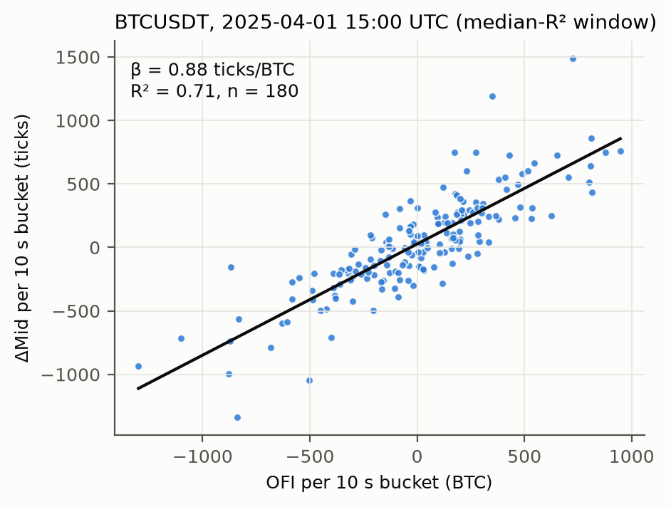
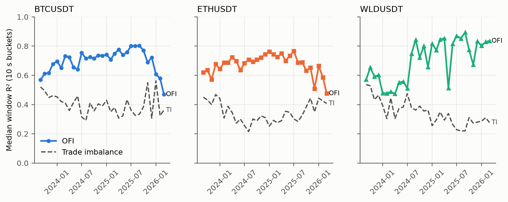
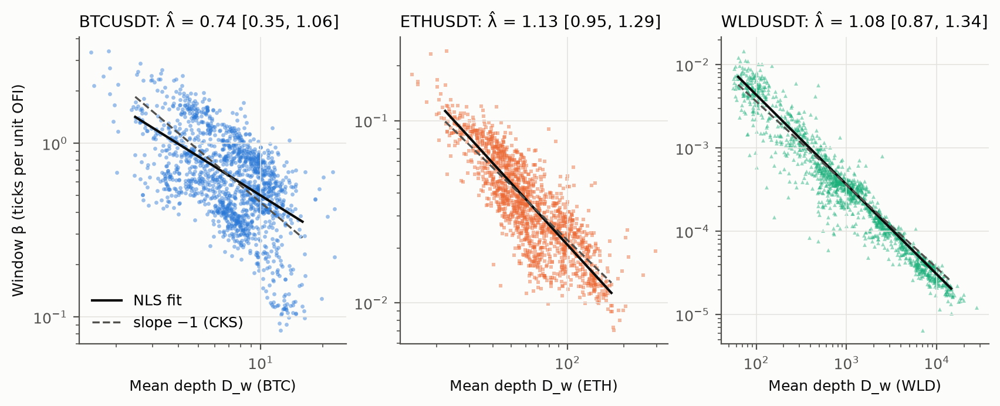
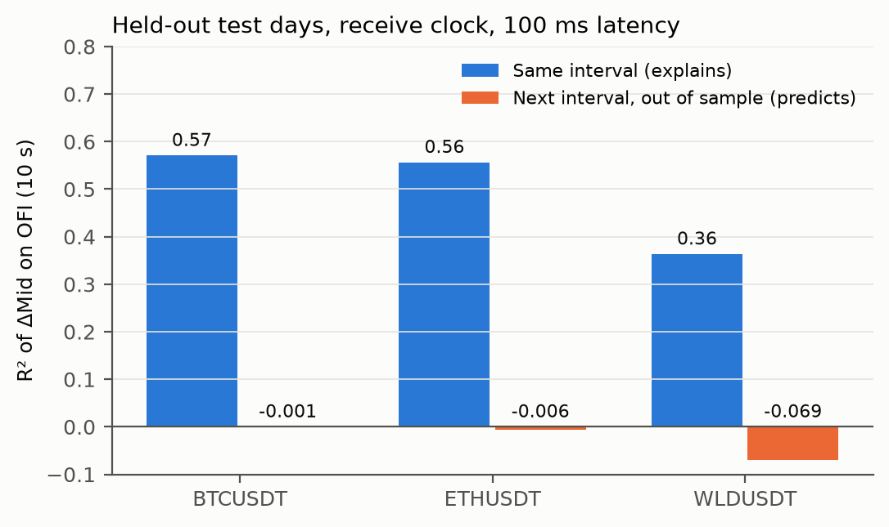

# Order-flow imbalance explains crypto price moves but doesn't predict them

*Replication of Cont–Kukanov–Stoikov (2014) on Binance USDⓈ-M perpetuals, plus a pre-registered out-of-sample prediction test. 2026-10-01. Code, data scripts and the full decision log: this repository.*

## Abstract

Order-flow imbalance (OFI), the net pressure from limit orders, cancellations and trades at the best quotes, is known to explain short-horizon price changes in US equities (Cont, Kukanov & Stoikov 2014). On Binance perpetuals (BTCUSDT, ETHUSDT, WLDUSDT; 31 days each, 2023-09 to 2026-03, native top-of-book data), OFI over 10-second buckets explains a median **69–73%** of mid-price variance, with a positive slope in all 4,464 thirty-minute windows. It roughly doubles the explanatory power of trade imbalance, and its slope scales like 1/depth (λ̂ ≈ 1.1 for ETH and WLD). But on six held-out test days, using only information received before the decision plus 100 ms of latency, OFI's out-of-sample R² for the **next** 10 seconds is **≤ 0** on every symbol (BTC −0.0008 [−0.0023, 0.0008]). A strategy trading on its sign earns about 0.1 bps per trade before costs, 36–71× less than Binance's 5 bps taker fee. Biggest caveat: one day per month and a single venue. The explanation-vs-prediction gap is consistent with OFI largely being the price move itself in a tick-constrained book, which is an exploratory interpretation, not a tested claim.

## 1. Question and mechanism

CKS define, for each change to the best quotes, an order-flow contribution

e_n = 1{Pᵇₙ ≥ Pᵇₙ₋₁}·qᵇₙ − 1{Pᵇₙ ≤ Pᵇₙ₋₁}·qᵇₙ₋₁ − 1{Pᵃₙ ≤ Pᵃₙ₋₁}·qᵃₙ + 1{Pᵃₙ ≥ Pᵃₙ₋₁}·qᵃₙ₋₁

and OFI_k = Σ e_n over bucket k. Limit orders added at the bid, and cancellations or market sells hitting the ask, push OFI up; the mirror events push it down. Their model is ΔMid_k = α + β·OFI_k + ε, with β ≈ c/depth: a thick book absorbs the same flow with a smaller price move. On US equities they report an average R² of about 65%.

The mechanism matters for interpretation. If the spread is one tick, the mid can only move when a whole best queue is depleted, and that depletion is exactly the −q_{n−1} term in e_n. In a tick-constrained book, OFI therefore nearly *contains* the price change. High contemporaneous R² is expected and is not, by itself, evidence of a tradable signal.

**Why crypto perps are a useful test:** continuous 24/7 trading, a single dominant venue, no NBBO fragmentation, free tick-level data, and a range of tick constraints across coins (BTC and ETH almost always trade at a 1-tick spread; WLD often does not).

## 2. Data

- **Source:** Tardis.dev free files (1st of each month), Binance USDⓈ-M futures. Main dataset `book_ticker` (native bookTicker, every top-of-book change, 1.2M–61M rows per symbol-day). Tardis `quotes` was rejected as the main source because it is rebuilt from the ~25 ms batched depth stream and folds ~19 events into each row (DECISIONS.md). On one BTC day it gives nearly the same R² (0.79 vs 0.80). `trades` provides the trade-imbalance baseline.
- **Sample:** 31 days per symbol, 2023-09-01 to 2026-03-01. Days from 2026-04 onward are a held-out test set for H5/H6 and are blocked by the data loader.
- **Third symbol:** chosen by a pre-registered rule applied only to 2023-08-01 (pre-sample). Among the top-20 USDT perps by volume, pick the one with the largest share of time at spread > 1 tick, subject to ≥ 1 update/s. The rule selected **WLDUSDT** (3.1%).
- **Cleaning:** none removed except ±2 min around funding times (00/08/16 UTC). Quality checks per day: no missing values, no timestamps going backwards, no crossed books, median receive delay 2.6–11.7 ms. Known defects, kept: rare real orders off the tick grid (≤ 0.007% of rows, with matching trades), and transient wide spreads lasting milliseconds.

## 3. Method and baselines

- **Clock (H1–H4):** exchange timestamp (the relation is mechanical, as of the event). H5/H6 use the receive clock (Section 5).
- **Buckets and windows:** 10 s buckets, 30 min windows, one OLS regression per window with Newey–West standard errors (4 lags). Robustness: 1 s / 30 min and 60 s / 2 h.
- **Depth:** D_w = mean over the window of (best bid size + best ask size)/2, sampled at bucket ends.
- **Baseline (H4):** trade imbalance, TI_k = Σ signed taker volume per bucket.
- **H3:** β_w = exp(a + γ·Z_w)·D_w^(−λ), fitted by nonlinear least squares on β levels, so windows with β ≤ 0 are not dropped. Z = 4-hour UTC block and weekend dummies.
- **Inference:** day-block bootstrap (10,000 draws, seed 20260930) for all aggregate claims, since days are the independent unit and windows within a day are correlated.
- **Guards:** placebo with OFI shifted ±5 buckets; hypotheses and test statistics committed before the corresponding runs (HYPOTHESES.md, DECISIONS.md); every run logged in `research/trial_ledger.csv`.

## 4. Results

*Figure 1. One 30-minute BTC window, chosen as the one closest to the median R² (not hand-picked).*

| Main spec (10 s / 30 min) | BTCUSDT | ETHUSDT | WLDUSDT |
|---|---|---|---|
| **H1** β > 0 (pass: ≥ 95% of windows) | 1488/1488 | 1488/1488 | 1488/1488 |
| H1 median R² [95% CI] | 0.71 [0.68, 0.73] | 0.69 [0.66, 0.70] | 0.73 [0.64, 0.79] |
| **H2** ΔR² from OFI·\|OFI\| (pass: < 0.02) | 0.012 [0.008, 0.017] | 0.011 [0.009, 0.018] | 0.045 [0.022, 0.071] |
| **H3** λ̂ (pass: in [0.7, 1.3], CI width < 0.6) | 0.74 [0.35, 1.06] | 1.13 [0.95, 1.29] | 1.08 [0.87, 1.34] |
| **H4** R²(OFI) − R²(TI) (pass: CI > 0) | 0.32 [0.27, 0.36] | 0.34 [0.29, 0.38] | 0.39 [0.28, 0.47] |
| Placebo (±5 buckets) median R² | 0.002 / 0.003 | 0.003 / 0.003 | 0.003 / 0.003 |
| **Verdicts** | H1 ✓ H2 ✓ **H3 ✗** H4 ✓ | all ✓ | H1 ✓ **H2 ✗** H3 ✓ H4 ✓ |

- **H1:** replicates on every symbol. Median R² of 0.69–0.73 lands above our pre-registered prediction of 0.2–0.6 and above CKS's ~0.65, consistent with these books being more tick-constrained than CKS's stocks (Section 7).
- **H4:** OFI roughly doubles the explanatory power of trade imbalance (Figure 2). Order-book events that are not trades (new limit orders, cancellations) carry most of the information, which is CKS's central point.
- **H3:** ETH and WLD are consistent with λ = 1 (Figure 3). BTC fails on precision, not on its point estimate: its depth varies only about 4× across windows (5th–95th percentile 3.2–13 BTC), which is too little range to pin down a slope. All bootstrap fits converged, and a log-log fit gives a similar 0.81.
- **H2:** linear to within 0.02 of R² for BTC and ETH. WLD shows real curvature (+0.045). Caveat: this test has limited power, because OFI·|OFI| is highly correlated with OFI (≈ 0.92 for Gaussian OFI).

*Figure 2. Per-day median window R², OFI (solid) vs trade imbalance (dashed).*

*Figure 3. Window β against mean depth, with the NLS fit (solid) and a slope −1 reference (dashed). λ̂ and bootstrap CIs are shown in each panel title.*

## 5. Does it predict? (H5/H6)

**Design (pre-registered; timing interpretation logged before any code).** Everything is timed on the **receive clock**: what we could have known, not exchange event time. The feature x_k is OFI over [t_{k−1}, t_k). The target is y_k = mid(t_{k+1}+L) − mid(t_k+L), with latency L = 100 ms (also 0 and 500 ms). A property test checks that the target interval never overlaps the feature interval. The model is a single OLS slope per symbol, fitted on 24 train days (2023-09 to 2025-08), checked on 7 validation days, and then evaluated **once**, with frozen coefficients, on 6 held-out test days (2026-04 to 2026-09). H5 passes if out-of-sample R² against the zero (random-walk) forecast is > 0. H6 is reported as a break-even cost: hold sign(ŷ) for one bucket, pay the taker fee plus the measured half-spread per unit of turnover.

*Figure 4. Held-out test days, receive clock. Blue: R² of OFI against the mid change over the same interval (one slope pooled across days, so lower than the per-window medians in Section 4). Orange: out-of-sample R² for the next interval with frozen train coefficients.*

| Test days, L = 100 ms | BTCUSDT | ETHUSDT | WLDUSDT |
|---|---|---|---|
| **H5** OOS R² vs zero forecast [day-bootstrap CI] | −0.0008 [−0.0023, 0.0008] | −0.0060 [−0.0114, −0.0016] | −0.069 [−0.32, −0.027] |
| Verdict (pass: > 0) | **FAIL** | **FAIL** | **FAIL** |
| **H6** gross edge, break-even cost per side | 0.11 bps | 0.07 bps | 0.14 bps |
| Reference cost per side (taker fee + median half-spread) | 5 + 0.007 bps | 5 + 0.025 bps | 5 + 1.6 bps |
| Validation OOS R² (for comparison) | 0.0003 | −0.0001 | −0.0046 |
| Walk-forward pooled OOS R² (19 non-test days) | 0.0016 | 0.0002 | −0.0001 |

- **H5 fails everywhere.** No variant or baseline beats the zero forecast on the test days: not depth-normalised OFI, lagged returns or lagged trade imbalance. Latency barely matters (BTC break-even 0.116 → 0.093 bps from 0 → 500 ms), because there is very little to lose.
- **The sign carries a trace of information.** The gross edge is positive on every symbol, but at 0.07–0.14 bps it sits 36–71× below the taker fee, and still 14–29× below the 2 bps maker fee (passive execution would also need a fill model, which is out of scope here). H6 fails, as its pre-registered prior expected.
- **WLD's strongly negative R² is a units problem, not a reversal.** Between train and test, WLD's price fell from $1.92 to $0.33 and its top-of-book depth in coins rose 32×. A slope fitted in "ticks per WLD of flow" over-predicts by test time, which is exactly what β ∝ 1/depth (H3) implies. Depth-normalised OFI avoids the blow-up (R² −0.0001) but has no edge either.
- **Disclosure:** the first final-test attempt crashed before computing anything (a missing data download). Nothing was evaluated or seen, the one-line fix and a note were committed, and the same run was repeated with unchanged frozen coefficients (DECISIONS.md).

*Fee reference: Binance USDⓈ-M VIP 0, 2 bps maker / 5 bps taker, from secondary sources checked 2026-10-01 (the official page requires a login). Because H6 reports a break-even cost, readers can compare against their own fee tier.*

## 6. Robustness and what failed

- **Bucket size:** the 1 s / 30 min and 60 s / 2 h specs give the same verdicts for every symbol. R² is lower at both extremes (e.g. BTC 0.62 at 1 s, 0.64 at 60 s, vs 0.71 at 10 s).
- **Time variation:** R² is not stable. BTC rises from 0.57 (2023-09) to ~0.80 (mid-2025), then falls to 0.47 (2026-03). ETH shows a similar late decline. The Phase 1 pilot (3 days) suggested a steady rise, which the full sample contradicts: a reminder of how misleading 3 days can be.
- **Failures, as pre-registered:** H3 on BTC (CI width 0.71 > 0.6), H2 on WLD (0.045 > 0.02), and H5/H6 on all three symbols.
- **Multiple testing:** 6 hypotheses × 3 symbols, plus robustness specs. The H1/H4 conclusions sit far from their thresholds. The closest calls are H2 on BTC and ETH (upper CI ≈ 0.017–0.018 vs 0.02).
- **Bugs found and fixed during the work** (all with regression tests): a pre-midnight seeding bug in bucketing; a silently truncated download; tick inference fooled by very low prices (it briefly mis-measured one candidate in the third-symbol selection, and re-running with the fix gave the same pick); memory blow-up on 50M-row days (fixed with chunked processing, verified identical to single-pass).

## 7. Exploratory: why is R² so high? (not pre-registered)

The tick-constraint mechanism in Section 1 predicts that R² should fall when spreads are wider than one tick. BTC and ETH can't test this (their spread is > 1 tick < 2% of the time). WLD can:

| WLD windows by share of time spread > 1 tick | ~0% | 0.6% | 1.1% | 6.7% | 32% |
|---|---|---|---|---|---|
| Median R² | 0.84 | 0.81 | 0.78 | 0.61 | 0.51 |

Across WLD's 31 days, median R² also tracks the tick's size relative to price (Spearman ρ = 0.75). At WLD's ~$8 peak in March–April 2024 the $0.0001 tick was 0.12 bps of price and R² was 0.47. At ~$0.40 in 2026 it was 2.5 bps and R² was 0.83. This supports the mechanism, but it is exploratory, it involves one coin, and it is confounded with time, activity and depth. It is a hypothesis for a follow-up test, not a finding.

## 8. Limitations

- Only one day per month, so intra-month dynamics and consecutive-day dependence are unobserved. The test set is just 6 days, which is why some CIs are wide.
- A single venue: Binance perps only, with no cross-venue flow.
- Prediction was tested with one simple model at one horizon (10 s). A null here doesn't rule out OFI being useful as one input among many, at other horizons, or for passive execution with a fill model. It does rule out "OFI alone, crossing the spread, at 10 s".
- Exchange timestamps have millisecond resolution, so ~70% of bookTicker rows share a millisecond with the previous row. Their order within a millisecond follows the file order.

## 9. What I'd do with more data or time

1. **Test the tick-constraint mechanism directly.** Pre-register Section 7's hypothesis and test it on symbols that had a tick-size change, a cleaner natural experiment than WLD's price drift.
2. **Consecutive days** (paid Tardis data) for intra-month dynamics and a larger test set.
3. **Cross-venue OFI:** does Binance flow lead other exchanges, where the latency gap is larger?
4. **Passive execution:** combine OFI with a queue-position fill model to ask whether it improves *maker* fills. This is the only route to an edge consistent with these numbers.
